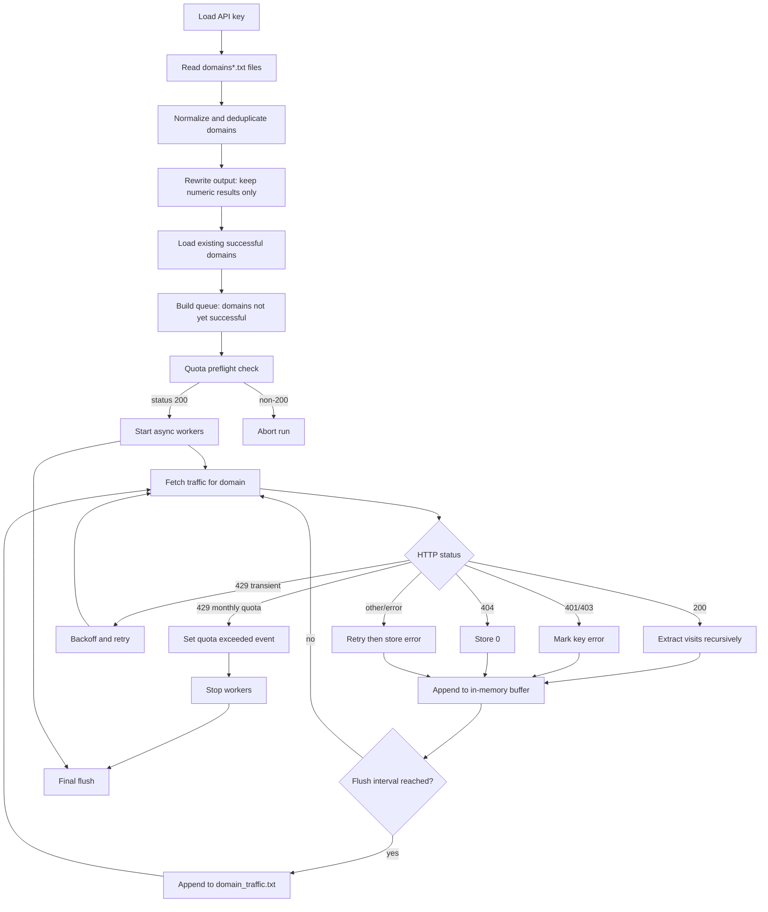

# 1. Title and Description

## Bulk Domain Traffic Checker

A resilient asynchronous traffic-intelligence logging utility for bulk domain analysis via the Similarweb RapidAPI endpoint.

[](https://www.python.org/)
[](https://docs.python.org/3/library/asyncio.html)
[](https://rapidapi.com/)
[](LICENSE)
[](#)

# 2. Table of Contents

- [1. Title and Description](#1-title-and-description)
- [2. Table of Contents](#2-table-of-contents)
- [3. Features](#3-features)
- [4. Tech Stack & Architecture](#4-tech-stack--architecture)
  - [Core Stack](#core-stack)
  - [Project Structure](#project-structure)
  - [Key Design Decisions](#key-design-decisions)
- [5. Getting Started](#5-getting-started)
  - [Prerequisites](#prerequisites)
  - [Installation](#installation)
- [6. Testing](#6-testing)
- [7. Deployment](#7-deployment)
- [8. Usage](#8-usage)
  - [CLI Usage](#cli-usage)
  - [Programmatic Usage](#programmatic-usage)
- [9. Configuration](#9-configuration)
  - [Runtime Constants](#runtime-constants)
  - [Input and Output Files](#input-and-output-files)
  - [Environment and Key Management](#environment-and-key-management)
- [10. License](#10-license)
- [11. Contacts & Community Support](#11-contacts--community-support)

# 3. Features

- Asynchronous bulk processing of domains using `asyncio` + `aiohttp` for efficient network I/O.
- Domain normalization pipeline (`scheme`, `www`, path, query, fragment, and port stripping) before API requests.
- Automatic multi-file ingestion using `domains*.txt` glob pattern.
- Built-in response parsing with recursive traversal to extract traffic fields from heterogeneous API payloads.
- Incremental output persistence with configurable buffer flush interval to reduce data loss risk.
- Restart-safe execution by reusing successful historical results from `domain_traffic.txt`.
- Output sanitation that removes previously failed/non-numeric entries before new runs.
- Robust retry and backoff handling for transient network errors, timeouts, and rate-limit responses.
- Preflight API quota check before processing workload.
- Rate-limit visibility via progress bar postfix (`requests remaining`) and startup diagnostics.
- Graceful shutdown on `SIGINT` / `SIGTERM`, including final buffered write.
- Quota exhaustion circuit-breaker to stop workers globally when monthly limits are reached.

> [!IMPORTANT]
> The tool currently runs with `CONCURRENCY_LIMIT = 1` by default to minimize quota pressure and avoid aggressive rate-limiting.

# 4. Tech Stack & Architecture

## Core Stack

- Language: Python 3.9+
- Concurrency model: `asyncio` cooperative multitasking
- HTTP client: `aiohttp`
- UX/CLI progress: `tqdm`
- Packaging/dependencies: `pip` + `requirements.txt`

## Project Structure

```text
bulk-domain-traffic-checker/
├── similarwebchecker.py      # Main asynchronous processing pipeline
├── requirements.txt          # Python dependencies
├── cmd_commands.txt          # Minimal run command reference
├── domain_traffic.txt        # Output cache/results store (generated/updated)
├── api_key(test).txt         # Example/placeholder key file
└── LICENSE                   # GPL-3.0 license
```

## Key Design Decisions

1. **At-least-once persistence strategy**
   - Results are periodically flushed to disk (`FLUSH_INTERVAL`) and always flushed on shutdown/finalization.
2. **Idempotent reruns via cache filtering**
   - Previously successful numeric records are skipped on subsequent executions.
3. **Fault-tolerant API interaction**
   - Retries with exponential backoff for HTTP `429` and retryable network conditions.
4. **Quota-aware orchestration**
   - Dedicated startup probe and global stop event when monthly cap is exceeded.
5. **Loose schema coupling**
   - Recursive key discovery (`find_visits`) avoids strict payload assumptions.



# 5. Getting Started

## Prerequisites

- Python `3.9` or newer.
- A RapidAPI subscription/key with access to `similarweb-insights` traffic endpoint.
- Unix-like shell or Windows terminal.

> [!WARNING]
> The script expects the API key in a file named `api_key.txt` (exact filename). If missing, execution stops immediately.

## Installation

1. Clone the repository:

```bash
git clone https://github.com/<your-org>/bulk-domain-traffic-checker.git
cd bulk-domain-traffic-checker
```

2. Create and activate a virtual environment (recommended):

```bash
python -m venv .venv
source .venv/bin/activate  # Linux/macOS
# .venv\Scripts\activate   # Windows PowerShell
```

3. Install dependencies:

```bash
pip install --upgrade pip
pip install -r requirements.txt
```

4. Create the API key file:

```bash
echo "<YOUR_RAPIDAPI_KEY>" > api_key.txt
```

5. Create at least one domain list file (supports multiple files via `domains*.txt`):

```bash
cat > domains1.txt <<'TXT'
google.com
https://www.github.com/
example.org/path?x=1
TXT
```

# 6. Testing

Although the repository does not currently ship a dedicated test suite, you should run the following validation checks before release:

```bash
python -m py_compile similarwebchecker.py
python -m pip check
python similarwebchecker.py
```

Recommended local quality gates (add to CI):

```bash
pip install pytest ruff
pytest -q
ruff check .
```

> [!NOTE]
> `pytest` and `ruff` are recommended developer tools; they are not currently pinned in `requirements.txt`.

# 7. Deployment

For production-style operation, prefer deterministic and repeatable execution:

1. **Containerize runtime** (optional but recommended).
2. **Inject API key via secret management** and materialize to `api_key.txt` at container start.
3. **Mount persistent volume** for `domain_traffic.txt` to preserve cache across restarts.
4. **Schedule periodic jobs** (e.g., cron, GitHub Actions, or external orchestrator) with controlled frequency based on quota.

Example `Dockerfile`:

```dockerfile
FROM python:3.11-slim
WORKDIR /app
COPY requirements.txt ./
RUN pip install --no-cache-dir -r requirements.txt
COPY . .
CMD ["python", "similarwebchecker.py"]
```

Example one-shot run:

```bash
docker build -t bulk-domain-traffic-checker .
docker run --rm -v "$PWD:/app" bulk-domain-traffic-checker
```

> [!CAUTION]
> Never bake real API credentials into images, commits, or CI logs.

# 8. Usage

## CLI Usage

Start processing with the default command:

```bash
python similarwebchecker.py
```

Expected runtime behavior:

- Performs quota preflight check against `google.com`.
- Prints total domain counts (all/cached/pending).
- Processes queue with progress bar updates.
- Saves output to `domain_traffic.txt` in format:

```text
example.com 123456
unknown.tld 0
bad-domain Ошибка ключа
```

## Programmatic Usage

You can reuse utility functions for custom pipelines.

```python
from similarwebchecker import clean_url, find_visits

raw = "https://www2.Example.com/path?q=1#anchor"
normalized = clean_url(raw)
print(normalized)  # example.com

payload = {
    "meta": {"region": "global"},
    "engagement": {"monthly_visits": 987654}
}

visits = find_visits(payload)
print(visits)  # 987654
```

> [!TIP]
> Keep input files clean and one domain per line for predictable normalization and deduplication behavior.

# 9. Configuration

## Runtime Constants

Configuration is currently code-driven via module-level constants in `similarwebchecker.py`:

| Constant | Default | Purpose |
|---|---:|---|
| `OUTPUT_FILE` | `domain_traffic.txt` | Destination file for persisted results. |
| `KEY_FILE` | `api_key.txt` | File containing your RapidAPI key. |
| `CONCURRENCY_LIMIT` | `1` | Number of worker tasks. |
| `FLUSH_INTERVAL` | `20` | Buffered write threshold (records). |
| `MAX_RETRIES` | `3` | Per-domain retry attempts. |
| `TIMEOUT_SECONDS` | `10` | Request timeout. |
| `WORKER_DELAY` | `1` | Delay between worker iterations (seconds). |
| `API_HOST` | `similarweb-insights.p.rapidapi.com` | RapidAPI host header value. |
| `API_URL` | `https://similarweb-insights.p.rapidapi.com/traffic` | Endpoint URL. |

## Input and Output Files

- **Input pattern**: all files matching `domains*.txt`.
- **Input format**: one domain/URL per line.
- **Output format**: `<domain> <traffic_or_error>` per line.
- **Cache policy**:
  - Numeric rows are treated as valid cached results.
  - Non-numeric rows are dropped on startup and re-queried.

## Environment and Key Management

Native `.env` support is not implemented yet. Recommended secure workflow:

1. Store key as environment variable in CI/CD or shell profile.
2. Generate `api_key.txt` at runtime:

```bash
printf "%s" "$RAPIDAPI_KEY" > api_key.txt
```

3. Ensure `api_key.txt` is ignored by VCS (`.gitignore`) in production forks.

# 10. License

This project is licensed under the GNU General Public License v3.0. See [LICENSE](LICENSE) for full terms.

# 11. Contacts & Community Support

## Support the Project

[](https://www.patreon.com/OstinFCT)
[](https://ko-fi.com/fctostin)
[](https://boosty.to/ostinfct)
[](https://www.youtube.com/@FCT-Ostin)
[](https://t.me/FCTostin)

If you find this tool useful, consider leaving a star on GitHub or supporting the author directly.
